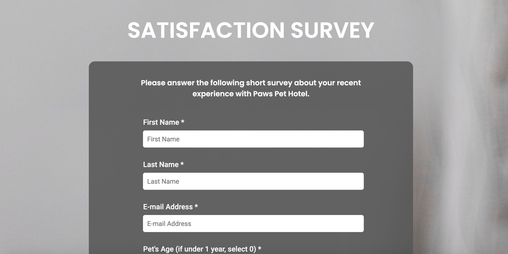

# Survey Form
A survey website I created for FreeCodeCamp's Survey Form project. I had to fulfill project requirements in order for my site to pass a series of automated tests. 
This site demonstrates my proficiency with HTML forms and CSS styling of form elements. Since the site is hosted in GitHub's Pages static environment, I was unable to include a POST request when the user submits the form. 

To view my website, <a href="https://ivanamiovcic.github.io/Survey/"> click here. </a> 
 
 
View project requirements on <a href="https://www.freecodecamp.org/learn/responsive-web-design/responsive-web-design-projects/build-a-survey-form"> FreeCodeCamp's website. </a>

## Website Preview
 

